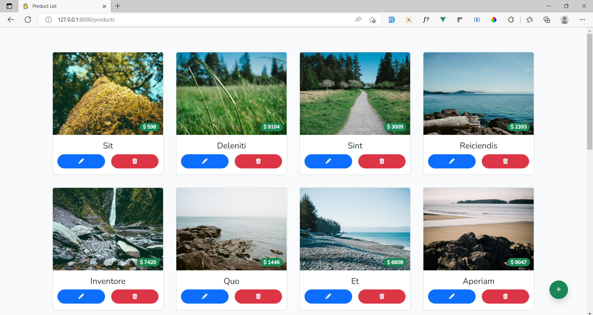

# Laravel9 + Vue 3 (use composition api syntax) + Inertia + TypeScript

## Preview


## Installation

Clone the repo locally:
```
git clone https://github.com/ZawWinTin-SCM/laravel-9-vue-3-inertia-typescript.git
```

Install PHP dependencies:

```
composer install
```

Install NPM dependencies:

```
npm install
```

Build assets:

```
npm run dev
```

Setup configuration:

```
cp .env.example .env
```

Generate application key:

```
php artisan key:generate
```

Create database and configure in `.env` file

eg.

```
DB_CONNECTION=mysql
DB_HOST=127.0.0.1
DB_PORT=3306
DB_DATABASE=example
DB_USERNAME=root
DB_PASSWORD=
```

Run database migrations:

```
php artisan migrate
```

Run database seeder:

```
php artisan db:seed
```

(Optional) If you want to get dummy data, run this:

```
php artisan db:seed --class=TestSeeder
```

Run the backend server:

```
php artisan serve
```

Run the frontend server:

```
npm run dev
```

Visit `localhost:8000/products` in your browser.